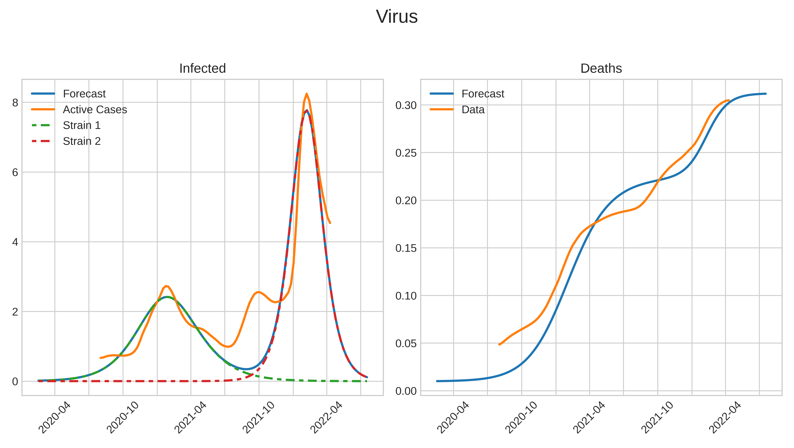

# Summary

At its core, `Snowdrop` is a robust and versatile Python package designed for the
analysis of macroeconomic *Dynamic Stochastic General Equilibrium* (*DSGE*) models.
In its entirety, this package offers an extensive framework for the study of various related
economic models, including *New Keynesian* models, *Real Business Cycle* models, *Gap*
models, and *Overlapping Generations* models. `Snowdrop` equips
researchers with essential tools to address the fundamental requirements of
these models, encompassing estimation, simulation, and forecasting processes.
In particular, the package employs robust and efficient solution techniques to
solve both linear and nonlinear perfect foresight models based on the rational
expectations hypothesis, which is a critical need for many *DSGE* models. Beyond
its core modeling capabilities, this package also provides tools for model
diagnostics and reporting. Additionally, it offers users the flexibility to
implement their models using pure Python code or straightforward (*YAML*)
configuration files.

# Statement of Need

*DSGE* models are a mainstay class of models employed by Central Banks around the
world, informing key country monetary policy decisions [@botman2007dsge], [@smets2010dsge], 
[@del2013frbny], [@yagihashi2020dsge].  These models capture
the dynamic evolution of economic variables influenced by agents who respond to
anticipated future outcomes in the present, necessitating the combined use of
specialized techniques that are not readily availabel even in the extensive list
of Python's scientific modeling packages [@fernandez2021estimating]. Currently, the two 
primary DSGE modeling toolboxes, [DYNARE](https://www.dynare.org/) and
[IRIS](https://iris.igpmn.org/), [@DynareUserGuide], [@IrisUserGuide] are comprehensive toolsets 
that offer an user-friendly infrastructure with support to all stages of model development.
These, and similar, applications, however, are either commercial, or rely on
commercial software to run, and hence require expensive licensing costs. There
is no integrated software package to our knowledge that is both flexible to
handle a wide class of models with all required software to run the models
available for free under the *GNU General Public Licensing* agreements. This
Framework, built entirely on Python, is intended to fill that void.

## Highlights

 - `Snowdrop` is a Python package that only uses open source libraries listed in the pypi repository.
 - This package is platform neutral and can be run on Windows, Linux, Unix, and Mac machines.
 - `Snowdrop` models can be written in user-friendly *YAML* format, pure Python scripts, or in a combination of both.
 - Transitioning from *IRIS* and *DYNARE* models to `Snowdrop` modes is easy since `Snowdrop` can read and run
 standard models written for these packages.
 - Non-linear equations are solved iteratively via Newton's method. `Snowdrop` implements the *ABLR* stacked matrices and *LBJ* [@Juillard:1998] forward-backward substitution method to solve such systems.  Linear models are solved with *Binder Pesaran's* method, *Anderson and More's* method and two generalized *Schur's* method that reproduce calculations employed in *Dynare* and *Iris*.
 - `Snowdrop` uses the *Scientific Python Sparse* package for dense and sparse matrices algebra.  For large sparse matrices
   algebra, it uses the *Pypardiso* package, which is an interface to the *Intel MKL PARallel DIrect SOlver* library.
 - Several desirable computational techniques for *DSGE* models are implemented in `Snowdrop`, including: 
    - Non-linear models can be run with time dependents parameters
    - Goodness of fit of model data can be checked via the *Bayesian* approach to the maximization of likelihood functions.
    - Model parameters can be sampled via the *Markov Chain Monte Carlo* affine invariant ensemble sampler algorithm of Jonathan Goodman and an adaptive Metropolis-Hasting’s algorithms of Paul Miles. The former algorithm is useful for sampling badly scaled distributions of parameters. The later algorithm employs adaptive Metropolis
   methods that incorporate delayed rejection to stimulate samples’ states mixing.

   - Data sets can be filtered in several different ways, such as: (1) the *Kalman* filter (linear and non-linear models), (2) the *Unscented Kalman* filter, (3) the *LRX* filter, (4) the *Hodrick-Prescott*
   filter, (5) the *Bandpass* filter, and (6) the *Particle* filter. Versions of *Kalman* filter and smoother algorithms include diffuse, 
   non-diffuse, multivariate and univariate filters and smoothers.
 - Finally, `Snowdrop` streamlines the model production process by aiding users with the plotting and model reporting and storage process.

# Examples of Model Files and Python Code

The simplest way to write a `Snowdrop` model, is by specifing it via an *YAML* file
in a manner that is familiar to *DYNARE* and *IRIS* users. Overall, the quickest 
way to run a model involves the following steps: 
   1. Create or modify existing *YAML model file* in models folder.
   2. Open *src/tests/test_toy_models.py* file and set *fname* to the name of this model file.
   3. Run the python script to get the desired simulations.

For example, the following specify a simple growth model with lagged variables. 

### Monetary Policy
```yaml
    name:  Monetary policy model example
    symbols:
      variables: [PDOT,RR,RS,Y]
      exogenous: [ers]
      shocks: [ey]
      parameters: [g,p_d1,p_d2,p_d3,p_rs1,p_y1,p_y2,p_y3]
      equations:
       - PDOT=p_dot1*PDOT(+1)+(1-p_d1)*PDOT(-1)+p_d2*(g^2/(g-Y)-g)+p_d3*(g^2/(g-Y(-1))-g)
       - RR=RS-p_d1*PDOT(+1)-(1-p_d1)*PDOT(-1)
       - RS=p_rs1*PDOT+Y+ers
       - Y=p_y1*Y(-1)-p_y2*RR-p_y3*RR(-1)+ey
      calibration:
       #Parameters
       g: 0.049
       #Set time varying parameters; the last value will be used for the rest of this array
       p_d1: 0.414 #[0.4,0.5,0.6]
       std: 0.02
    options:
       T : 14
       periods: [1]
       shock_values: [std]
```

### Imposing Shocks
```yaml
    # Create model object
    from snowdrop.src import driver
    model = driver.importModel(model_file_path)
    # Set shocks
    model.options["periods"] = [1]
    model.options["shock_values"] = [0.02]
    # Define list of variables for which decomposition plots are produced
    decomp = ['PDOT','RR','RS','Y']
    # Run simulations
    y, dates = driver.run(model=model, decomp_variables=decomp, Plot=True)
```

### Kalman Filter
```yaml
    # Create model object
    from snowdrop.src import driver
    model = driver.importModel(model_file_path, Solver="Klein", Filter="Durbin_Koopman",
            Smoother="Durbin_Koopman", Prior="Equilibrium", measurement_file_path=meas)
    # Set simulation and filtration time ranges
    simulation_range = [[1997,1,1],[2013,12,1]]
    filter_range = [[1998,1,1],[2013,12,1]]
    model.options["range"] = simulation_range
    model.options["filter_range"] = filter_range
    # Set starting values of endogenous variables
    model.setStartingValues(hist=meas)
    # Get filtered and smoothed results, date range, filtered and smoothed shocks
    y,dates,epsilonhat,etahat=driver.kalman_filter(model,Output=True,fout=output_file_path)
```

### Anticipated, Unanticipated Shocks, and Judgmental Ajustments
```yaml
    from snowdrop.src.driver import run
    ## Combination of soft and hard tunes:
    # Set shock for gap of output to 1% at period 3
    d = {"SHK_L_GDP_GAP": [(3,1)]}
    model.setShocks(d)
    # Impose judgments
    date_range = pandas.date_range(start, end, freq="QS")
    m = {"L_GDP_GAP": pandas.Series([-1.0, -1.0, -1.0], date_range)}
    shocks_names  = ["SHK_L_GDP_GAP"]
    # Endogenize shock and exogenize output gap endogenous variable
    model.swap(m, shocks_names)
    # Run simulations
    y, dates = driver.run(model)
```

# Status

This toolkit provides users with an integrated Framework to input their models, import data, perform the  desired
computational tasks (solve, simulate,  calibrate or estimate) and obtain well formatted post process output in the form
of tables, graphs etc. [@Goumilevski:2021]. It has been applied for several cases including study of macroeconomic effects of monetary policy, estimation of Peter's Ireland model [@Ireland:2004], and forecast of economic effects of COVID-19 virus, to name a few.  Figure below illustrates forecast of inflation, nominal and real interest rates, and output gap to output shock of 2% imposed at period 1 and revision of monetary policy rate of 3% imposed at period 4. 


Another example illstrates economic effects of pandemic. We used Eichenbaum-Rebelo-Trabandt (*ERT*) model [@Eichenbaum:2020] which embeds epidemiological concepts into *New Keynesian* modelling framework. We assumed that there two strains of pathogens and emplyed Suspected-Infected-Recovered (*SIR*) epideomiological model:

$$
dS/dt = -(\beta_1 I_1 + \beta_2 I_2) S - \nu S
$$
$$
dI_1/dt = \beta_1 I_1 S - (\mu + \nu_1) I_1
$$
$$
dI_2/dt = \beta_2 I_2 S - (\mu + \nu_2) I_2
$$
$$
dR/dt = \mu (I_1 + I_2) S + \nu S
$$
$$
dD/dt = \gamma_1 I_1 + \gamma_2 I_2
$$

Here $I_1$, $I_2$  are the individuals infected by strains 1 and 2, $R$ is the stock of recovered, $D$ are deseaced, $\beta_1$, $\beta_2$ are the transmission rates of strains 1 and 2, and  $\nu$ is the suspected population vaccination rate.

 

Infection is transmitted through interaction of susceptible and infected and thru economic activities such as work and shopping.

$$
T = \pi_1 (S C_s) (I C_i) + \pi_2 (S N_s) (I N_i) + \pi_3 (S I)
$$

where $C_s$, $C_i$ are the consumptions of suspected and infected individuals, and $N_s$, $N_i$ are the working hours, and $\pi_1$, $\pi_2$, $\pi_3$ are constants.  These constants are calibrated assuming that 2/3 of the virus transmission come from the infected - suspected interactions, and 1/6 from economic activities such as work and shoping.

These epideomiological equations were plugged in into *ERT* model consisting of sixty-four equations of macroeconomic variables of sticky and flexible price economies. The macroeconomic variables of these two economies are linked thru Taylor rule equation for policy interest rate. Model is highly non-linear and is solved by using a homotopy method where parameters are adjusted step-by-step.  We assumed that the government containment measures were more lenient during the second strain of virus compared to the first one, i.e. the second strain contribution to the infected $I = I_1 + \delta I_2$ was attenuated with the factor, $\delta = 0.05$.


# Acknowledgements

   Authors would like to thank Doug Laxton for initiating this project, Farias Aquiles for his guidance and support,
   and Kadir Tanyeri for his valuable comments.

# References


