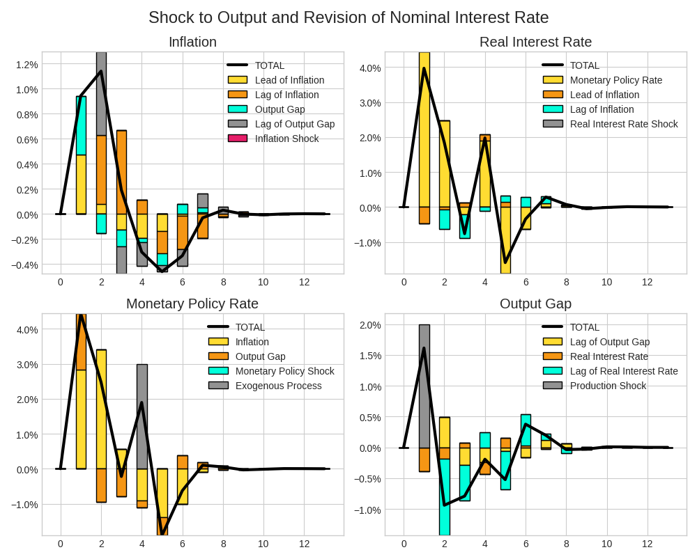
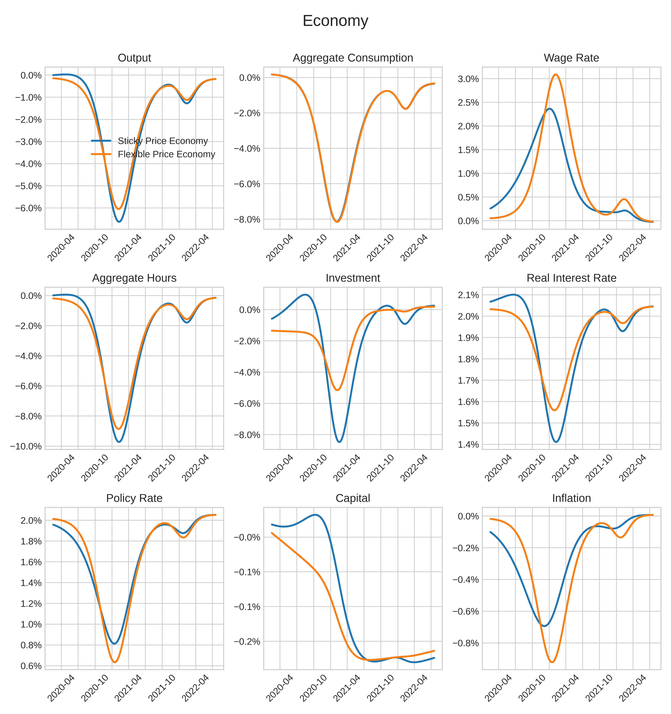

# Summary

At its core, `Snowdrop` is a versatile Python package designed for the analysis of macroeconomic *Dynamic Stochastic General Equilibrium* (*DSGE*) models. These *DSGE* models form a class of macroeconomic frameworks that elucidate the economy's behavior by considering the intertemporal decisions made by economic agents, including households, firms, and the government.  `Snowdrop` package provides an extensive framework for studying various related economic models, including *New Keynesian* models, *Real Business Cycle* models, *Gap* models, and *Overlapping Generations* models. `Snowdrop` equips researchers with essential tools to address the fundamental requirements of these models, encompassing estimation, simulation, and forecasting processes.  In particular, the package employs robust and efficient solution techniques to solve both linear and nonlinear perfect foresight models based on the rational expectations hypothesis, which is critical for many DSGE models.

# Statement of need

*DSGE* models are a fundamental class of models utilized by central banks worldwide, informing key monetary policy decisions [@botman], [@smets], [@del], [@yagihashi]. These models capture the dynamic evolution of economic variables influenced by agents who respond to anticipated future outcomes in the present.  They account for the transmission of random shocks and their effects on the economy, primarily serving to analyze the impacts of economic policy and facilitate forecasting. This necessitates the use of specialized techniques that are not readily available even in the extensive list of Python's scientific modeling packages [@fernandez]. The three primary DSGE modeling toolboxes currently include [DYNARE](https://www.dynare.org), [IRIS](https://iris.igpmn.org) and [TROLL](https://www.intex.com/troll/history.html). While *Dynare* and *IRIS* are free and open-source software, they were primarily developed to run on the *MATLAB* platform, which is commercial. In contrast,*TROLL*, on the other hand, is a commerial application and requires subscription.

Each of these applications has its own advantage. The ease of use through a user-friendly interface, combined with the capability to handle a variety of models, has led to the immense popularity of *DYNARE* among general equilibrium modelers. However, *DYNARE* can only handle stationary *DSGE* models and requires users to write models in a stationary format by introducing variable deflators. The *IRIS* macroeconomic toolbox is another excellent tool that has gained popularity among economists for analyzing non-stationary *DSGE* models. *TROLL*, on the other hand, specializes in efficiently solving and simulating large systems of equations. All these applications, however, are either commercial or are relying on commercial software that requires expensive licensing costs. To our knowledge, there is no integrated software package that is flexible enough to handle a wide range of models and available for free under the GNU General Public License agreements. This framework aims to fill that void. 

`Snowdrop` is designed to assist economists and others in developing and analyzing complex economic problems.   Benchmarking this software against the *DYNARE* and *IRIS* toolboxes for small to medium-sized models with several hundred equations demonstrates comparable CPU execution times but a smaller memory footprint, due to the significant memory requirements of *MATLAB*.


## Highlights

- Models specifications can be written in user-friendly *YAML* format, pure Python scripts, or in a combination of both.
- Non-linear equations are solved iteratively via Newton's method. `Snowdrop` implements the *ABLR* stacked matrices and *LBJ* [@Juillard] forward-backward substitution method to solve such systems.
- Linear models are solved with *Binder Pesaran's* method, *Anderson and More's* method and two generalized *Schur's* method that reproduce calculations employed in *Dynare* and *Iris*.
- Non-linear models can be run with time dependent parameters.
- Goodness of fit of model data can be checked via the *Bayesian* approach to the maximization of likelihood functions.
- Model parameters can be sampled via the *Markov Chain Monte Carlo* affine invariant ensemble sampler algorithm of Jonathan Goodman and an adaptive Metropolis-Hasting’s algorithms of Paul Miles. The former algorithm is useful for sampling badly scaled distributions of parameters. The later algorithm employs adaptive Metropolis methods that incorporate delayed rejection to stimulate samples’ states mixing.
- Finally, `Snowdrop` streamlines the model production process by aiding users with the plotting and model reporting and storage process.

`Snowdrop` model file is essential for conducting simulations and analyses. It is written in *YAML* format in a manner that is familiar to *DYNARE* and *IRIS* users. Running a model involves the following steps:

1. Create or modify an existing *YAML model file* in the models folder.
2. Open the *tests/test_toy_models.py* file and set *fname* to the name of your model file.
3. Run the Python script to obtain the desired simulations.

For example, the following specifies a simple monetary policy model with lagged variables.

## Example of a model file

```yaml
    name:  Monetary policy model example
    symbols:
      variables: [PDOT,RR,RS,Y]
      exogenous: [ers]
      shocks: [ey]
      parameters: [g,p1,p2,p3,p4,p5,p6,p7]
      equations:
       - PDOT=p1*PDOT(+1)+(1-p1)*PDOT(-1)+p2*(g^2/(g-Y)-g)+p3*(g^2/(g-Y(-1))-g)
       - RR=RS-p1*PDOT(+1)-(1-p1)*PDOT(-1)
       - RS=p4*PDOT+Y+ers
       - Y=p5*Y(-1)-p6*RR-p7*RR(-1)+ey
      calibration:
       #Parameters
       g: 0.049
       #Set time varying parameters; the last value will be used for the rest of this array
       p1: 0.414 #[0.4,0.5,0.6]
       std: 0.02
    options:
       T: 14
       periods: [1]
       shock_values: [std]
```

# Results

This toolkit provides users with an integrated Framework to input their models, import data, perform desired computational tasks (solve, simulate, calibrate, or estimate), and obtain well-formatted post-process output in the form of tables, graphs, etc. [@Goumilevski]. It has been applied in several cases, including studying the macroeconomic effects of monetary policy, estimating Peter's Ireland model [@Ireland], and forecasting the economic effects of the COVID-19 virus, to name a few. The figure below illustrates the forecast of inflation, nominal and real interest rates, and the output gap in response to an output shock of 2% imposed at period 1 and a revision of the monetary policy rate of 3% imposed at period 4.



Another example illustrates the economic effects of the pandemic. We used the Eichenbaum-Rebelo-Trabandt (ERT) model [@Eichenbaum], which embeds epidemiological concepts into a New Keynesian modeling framework. We assumed that there are two strains of pathogens and employed a Suspected-Infected-Recovered (SIR) epidemiological model. These epidemiological equations were incorporated into the ERT model, consisting of sixty-four equations of macroeconomic variables from sticky and flexible price economies. The macroeconomic variables of these two economies were linked through a Taylor rule equation for the policy interest rate. The model is highly non-linear and is solved using a homotopy method, where parameters are adjusted step-by-step. We assumed that government containment measures were more lenient during the second strain of the virus compared to the first one. Figures 2 and 3 illustrate the forecast of virus transmission and deviations of macroeconomic variables from their steady state.




# Acknowledgements

The authors would like to thank Douglas Laxton for initiating this project, Farias Aquiles for his guidance and support, and Kadir Tanyeri for his valuable comments.

# References
